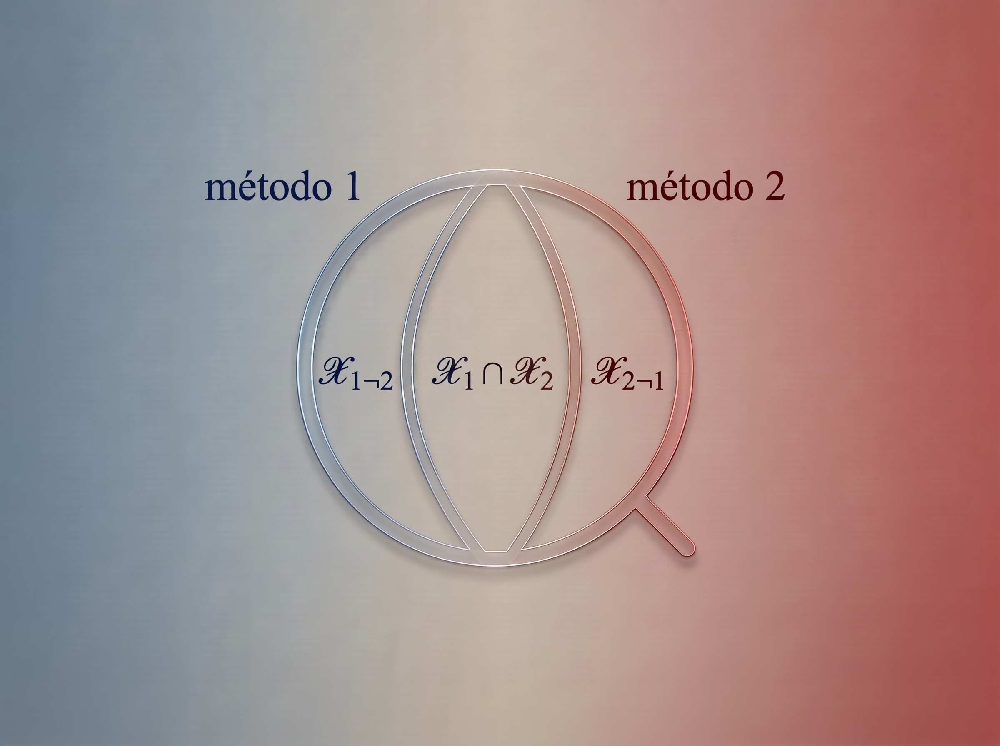



## 

Imaginá que sometés dos modelos de clasificación distintos al mismo banco de pruebas y ambos obtienen métricas  similares: *accuracy*, curva ROC y la predicción de que exactamente doscientas muestras de una gran base de datos son candidatas positivas. En cualquier informe ejecutivo o panel de métricas agregadas, ambos algoritmos parecerían gemelos intercambiables, desde el punto de vista de la predicción de la masa.

Supongamos que podemos mirar ambas listas de aquellos doscientos seleccionados por cada modelo y verificás que **no comparten un solo elemento**. La coincidencia es exactamente cero.

La reacción intuitiva ante semejante brecha suele ser el desconcierto o la desconfianza: asumir que al menos uno de los modelos está alucinando o que el problema está saturado de ruido. Sin embargo, cuando analizamos este choque bajo el prisma de la teoría de la información bayesiana y el aprendizaje activo, la conclusión es exactamente la opuesta.

El desacuerdo frontal entre clasificadores competentes rara vez es fruto del azar. Es la huella matemática de una asimetría informativa fértil: la prueba de que dos sistemas están mirando la misma realidad a través de lentes conceptuales ortogonales. Lejos de ser un fallo que deba disimularse con promedios, esa zona de conflicto es precisamente el lugar donde se esconde la mayor ganancia de información posible.

## Formulación del problema

Sea $\mathscr{X}$ el espacio muestral o dominio de datos de entrada. Consideremos dos clasificadores previamente entrenados, denotados como Método 1 ($h_1$) y Método 2 ($h_2$), representados como funciones medibles $h_i: \mathscr{X} \to Y$, en particular consideremos el caso de clasificaión binaria $Y=\{-1,1\}$.

Para cada método $i \in \{1, 2\}$, el subconjunto de instancias predichas como "positivas" ($+1$) se define como:

$$
\mathscr{X}_i = \{x \in \mathscr{X} : h_i(x) = +1\} \subseteq \mathscr{X}
$$

La discrepancia unilateral entre ambos clasificadores se captura mediante la diferencia de conjuntos de positivos, que aísla las instancias clasificadas como positivas por el método $i$ pero rechazadas por el método $j\neq i$:

$$
\mathscr{X}_{i \neg j} = \mathscr{X}_i - \mathscr{X}_j = \{x \in \mathscr{X} : x \in \mathscr{X}_i \land x \notin \mathscr{X}_j\}
$$

Notar que:
$$
\begin{aligned}
\mathscr{X}_i &= \mathscr{X}_{i\neg j} \cup (\mathscr{X}_i \cap \mathscr{X}_j) \\
\emptyset &= \mathscr{X}_{i\neg j} \cap (\mathscr{X}_i \cap \mathscr{X}_j)
\end{aligned}
$$

Decimos que existe **desacuerdo total** en la clase positiva cuando la intersección de las predicciones positivas es vacía:
$$
\mathscr{X}_1 \cap \mathscr{X}_2 = \emptyset
$$

En un escenario de clasificación binaria $\{-1, +1\}$, la región de desacuerdo bilateral global (la zona de conflicto estricto donde un modelo predice $+1$ y el otro $-1$) equivale directamente a la unión disjunta de ambas diferencias:

$$
\text{DIS}(\{h_1, h_2\}) = \{x \in \mathscr{X} : h_1(x) \neq h_2(x)\} = \mathscr{X}_{1 \neg 2} \cup \mathscr{X}_{2 \neg 1}
$$

Podemos visualizar estos conjuntos mediante esta representación

donde

*   **izquierda ($\mathscr{X}_{1 \neg 2}$):** Representa el subconjunto exclusivo de positivos del Método 1 (coloreado en azul).
*   **derecha ($\mathscr{X}_{2 \neg 1}$):** Representa el subconjunto exclusivo de positivos del Método 2 (coloreado en rojo).
*   **centro ($\mathscr{X}_1 \cap \mathscr{X}_2$):** Representa la zona de consenso explícito.

Si se cumple que $\mathscr{X}_1 \cap \mathscr{X}_2 = \emptyset$, equivale a un vaciamiento completo del centro y la totalidad de la masa se desplaza hacia los extremos.

## Objetivos de la clasificación

Para comprender las consecuencias de este desacuerdo, es indispensable distinguir el propósito operativo con el que se utiliza el sistema de clasificación: la estimación de una característica global del conjunto frente a la selección de candidatos a nivel unitario.

Supongamos que ambos métodos clasifican a la misma cantidad de elementos positivos:

$$
\mathtt{card}(\mathscr{X}_{1}) = \mathtt{card}(\mathscr{X}_{2})
$$

Bajo esta condición, cada clasificador reportará de forma independiente la misma tasa de selección bruta ($\hat{p} = \mathtt{card}(\mathscr{X}_i) / |\mathscr{X}|$). Más aún: si la distribución subyacente de la clase positiva real se reparte de forma simétrica entre ambos conjuntos exclusivos $\mathscr{X}_{1\neg 2}$ y $\mathscr{X}_{2\neg 1}$, **ambos modelos pueden exhibir exactamente la misma matriz de confusión global**. Es decir, pueden arrojar idénticos valores de precisión, exhaustividad (*recall*), exactitud (*accuracy*) y puntuación $F_1$. 

Desde la perspectiva de un cuadro de mando macroscópico o una tabla de *benchmarking*, el cambio del Método 1 al Método 2 se percibe como volumétricamente anodino: el sistema reporta la misma masa agregada y la misma efectividad aparente, sugiriendo una perfecta equivalencia funcional entre algoritmos.

Sin embargo, cuando la intersección es vacía ($\mathscr{X}_1 \cap \mathscr{X}_2 = \emptyset$), tales métricas provienen exclusivamente de los conjuntos disjuntos $\mathscr{X}_{1\neg 2}$ y $\mathscr{X}_{2\neg 1}$. 

Cuando la clasificación opera como un filtro de selección a nivel micro, donde cada predicción positiva dispara una acción irreversible y/o costosa, como seleccionar una molécula para síntesis en laboratorio o intervenir a un paciente, la condición de desacuerdo estricto representa un colapso estructural del filtro:

1. todos los elementos seleccionados por el Método 1 ($\mathscr{X}_{1 \neg 2}$) son sistemáticamente descartados por el Método 2.
2. todos los elementos seleccionados por el Método 2 ($\mathscr{X}_{2 \neg 1}$) eran considerados negativos por el Método 1.

Lo que a nivel agregado se diagnostica como una anodinia volumétrica (variación nula en el total de seleccionados y paridad de rendimiento estadístico), en el plano operativo constituye una sustitución completa del grupo objetivo. El filtro ha cambiado radicalmente la identidad de cada candidato.

## Fundamentos teóricos

Para unificar la teoría de la información con la explotación operativa de estos modelos, requerimos de dos andamiajes teóricos complementarios.

### Un teorema sobre agentes bayesianos

La información de la que dispone cada clasificador $i \in \{1, 2\}$ se representa mediante una partición $\mathscr{P}_i$ sobre $\mathscr{X}$. La probabilidad posterior asignada por el clasificador $i$ a un evento objetivo $A$ (ej. "la molécula es candidata") condicionada a su partición es $q_i(x) = p(A \mid P_i(x))$.

El **teorema de Aumann (1976)** demuestra  la imposibilidad de que dos agentes bayesianos con un prior común discrepen en sus probabilidades posteriores, cuando son de conocimiento común.

### Clasificadores como agentes bayesianos

En teoría de la decisión formal, un agente racional no es más que un operador matemático que evalúa la probabilidad condicional de un evento dada una partición de información. Bajo esta formulación, un clasificador $h_i$ actúa directamente como un agente durante la fase de inferencia: proyecta cada entrada $x \in \mathscr{X}$ sobre la celda $P_i(x)$ de su partición $\mathscr{P}_i$ y le asigna una probabilidad posterior $q_i(x) = P(Y = +1 \mid P_i(x))$.

Dado que el teorema de Aumann afirma que el desacuerdo es imposible bajo condiciones de simetría informativa y conocimiento común, su violación en la práctica resulta reveladora. La existencia de una región de desacuerdo ($q_1(x) \neq q_2(x)$ para $x \in \mathscr{X}_{1 \neg 2} \cup \mathscr{X}_{2 \neg 1}$) no es un mero "ruido estadístico" ni un fallo de optimización; demuestra matemáticamente que el entorno de inferencia rompe las hipótesis del teorema.

Los modelos discrepan estricta y necesariamente por:

1. Asimetría informacional: poseen representaciones asimétricas de los datos, sus particiones informativas son distintas ($P_1(x) \neq P_2(x)$). El diseñador del sistema fija estas condiciones iniciales al seleccionar el espacio de entrada; por ejemplo, un modelo observa descriptores fisicoquímicos tradicionales mientras el otro procesa grafos topológicos o estados cuánticos. Como resultado, dos instancias colapsadas y funcionalmente indistinguibles en un mismo bloque bajo el Método 1, son resueltas y separadas por el Método 2.
2. Priors incompatibles: tienen sesgos inductivos dispares, sus arquitecturas, funciones de pérdida y métodos de regularización imponen supuestos de partida incompatibles sobre cómo generalizar la frontera de decisión en el espacio $\mathscr{X}$. No comparten una distribución previa común sobre la regularidad del problema.
3. Ausencia de conocimiento común: operan mediante inferencia aislada, a diferencia del postulado teórico donde el intercambio transparente de estimaciones obliga a actualizar las probabilidades hasta coincidir por completo, los clasificadores realizan predicciones de forma estática y desacoplada. No existe un protocolo de comunicación iterativo entre ellos para alcanzar el conocimiento común en tiempo real.El desacuerdo es, por tanto, la prueba computable de una complementariedad epistémica: los modelos están particionando el espacio de características de manera ortogonal. En el régimen de desacuerdo total ($\mathscr{X}_1 \cap \mathscr{X}_2 = \emptyset$), esta divergencia es la manifestación geométrica inequívoca de que cada clasificador ha descubierto reglas estructurales que el otro, por diseño, es completamente incapaz de ver.

### Aprendizaje activo basado en desacuerdo

Mientras Aumann nos da el diagnóstico epistémico, Hanneke formaliza el protocolo operativo para aprovecharlo. 

Para nuestro comité de dos clasificadores $\{h_1, h_2\}$, la región de desacuerdo es $\text{DIS}(\{h_1, h_2\}) = \mathscr{X}_{1 \neg 2} \cup \mathscr{X}_{2 \neg 1}$. El algoritmo CAL (Cohn, Atlas, Ladner) de aprendizaje activo explota esta geometría evaluando cada punto no etiquetado $X_m$:

* si $X_m \in \text{DIS} \implies$ consultar etiqueta $Y_m$ al oráculo
* si $X_m \notin \text{DIS} \implies$ inferir etiqueta por consenso unánime sin consulta

Hanneke mide la tasa de contracción de esta región mediante el coeficiente de desacuerdo $\theta$. Cuando $\theta(\epsilon) = O(1)$, la complejidad de etiquetas demandada disminuye exponencialmente respecto al aprendizaje pasivo (muestreo aleatorio), pasando de $O(1/\epsilon)$ a $O(\log(1/\epsilon))$.

## Explotando el desacuerdo

En lugar de ver la divergencia de clasificadores como un problema de auditoría defensiva, la intersección entre la asimetría de Aumann y el muestreo de Hanneke proporciona un mapa del tesoro para la **captura de valor**, especialmente en dominios donde la validación es extremadamente costosa. 

Pensemos, por ejemplo, en una fase temprana de *drug discovery* para evaluar la inhibición de una diana terapéutica. El "oráculo" aquí es una síntesis en laboratorio o un ensayo *in vitro*, recursos altamente limitados. Tenemos dos modelos de clasificación (por ejemplo, un modelo clásico basado en descriptores fisicoquímicos tradicionales y un modelo emergente que emplea representaciones diferentes).

Si detectamos un alto grado de divergencia ($\mathscr{X}_1 \cap \mathscr{X}_2 \approx \emptyset$), la estrategia de captura de valor dicta lo siguiente:

### 1. Consenso como explotación segura

La zona de acuerdo positivo ($\mathscr{X}_1 \cap \mathscr{X}_2$) agrupa los candidatos "seguros". Ambos sesgos inductivos coinciden. Sin embargo, estas moléculas suelen pertenecer a espacios químicos bien conocidos y redundantes. Gastar presupuesto de laboratorio aquí tiene un bajo riesgo, pero también una baja ganancia de información (retorno de inversión epistémico marginal).

### 2. Desacuerdo como exploración

Las regiones $\mathscr{X}_{1 \neg 2}$ y $\mathscr{X}_{2 \neg 1}$ no son zonas de error, sino fronteras de exploración. Si muestreamos candidatos en $\mathscr{X}_{2 \neg 1}$ y el oráculo  confirma la positividad, habremos validado que el sesgo inductivo de $h_2$ está capturando lógicas subyacentes (topológicas, estructurales) invisibles para el modelo clásico. Esta zona concentra los candidatos más innovadores, aquellos capaces de superar los cuellos de botella clásicos del cribado.

## Conclusiones

El desacuerdo entre dos clasificadores no debe interpretarse como ruido aleatorio, sino como la manifestación geométrica de una asimetría en la información y complementariedad de sesgos inductivos (Aumann, 1976).

Delimitar formalmente la región de desacuerdo $\text{DIS}$ permite concentrar el presupuesto de validación experimental en las fronteras de conflicto (Hanneke, 2014). En dominios complejos, explotar el desacuerdo es la forma más rápida y matemáticamente óptima de transitar desde los espacios de conocimiento trillados hacia fronteras de descubrimiento de alto valor.

## Referencias

*   Aumann, R. J. (1976). Agreeing to disagree. *The Annals of Statistics*, 4(6), 1236–1239.
*   Hanneke, S. (2014). Theory of disagreement-based active learning. *Foundations and Trends in Machine Learning*, 7(2–3), 131–309.